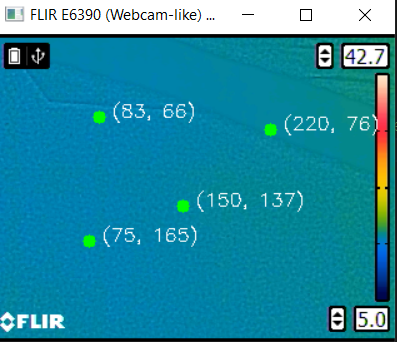
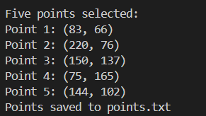
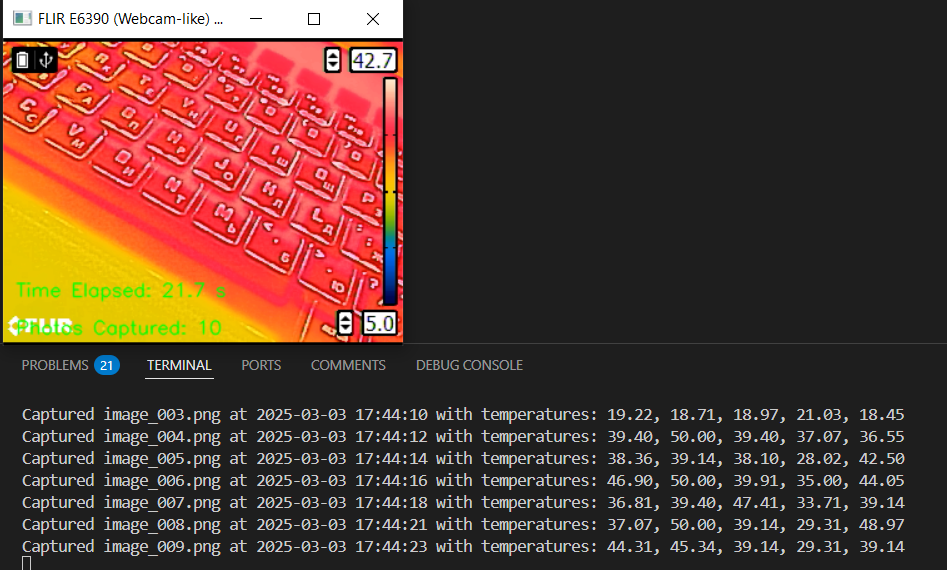
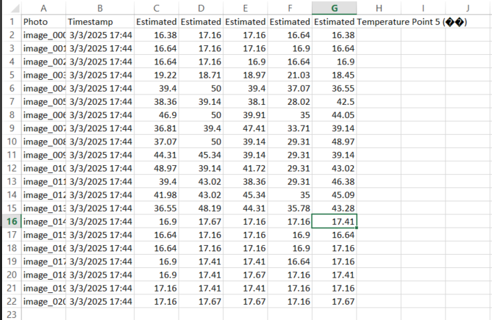

# Temperature Estimation from Thermal Images

This Python script captures a live video stream from a camera, extracts a temperature mapping from a designated scale bar region in the image, estimates temperatures at predefined points, and logs the results along with timestamps. It is designed for applications such as analyzing thermal images (e.g., from a FLIR device) in a webcam-like setup.

## Overview

The script performs the following steps:
- **Capture Video Stream:** Uses OpenCV to stream live video.
- **Photo Capture:** Saves an image every `2` seconds.
- **Color-to-Temperature Mapping:** Extracts a mapping from a specified region (scale bar) of the image, converting pixel colors to temperature values.
- **Temperature Estimation:** Estimates the temperature at 5 user-specified coordinate points based on the color mapping.
- **Data Logging:** Saves captured images in a `photos` directory and logs temperature data with timestamps into a CSV file.


## The scheme on how to run the code: 
- **Go to the Folder of Full code** and run `points_extract.py` to extract the point.
- **Go to the Folder of Full code** and run `user_input.py` or `realtime_plotting.py` to run the system.

## Features

- **Live Video Stream:** Displays a video stream with overlay text for elapsed time and number of captured photos.
- **Automatic Image Capture:** Saves images at a specified time interval.
- **Temperature Estimation:** Converts pixel color (from BGR to normalized RGB) into temperature values using a scale bar.
- **CSV Logging:** Logs each captured image's filename, timestamp, and estimated temperatures for five points.
- **User Inputs:** Prompts for temperature scale parameters and a file containing 5 coordinate points.

## Requirements

- Python 3.x
- [OpenCV (opencv-python)](https://pypi.org/project/opencv-python/)
- [NumPy](https://pypi.org/project/numpy/)

## Installation

1. **Clone or Download** the repository containing this script.
2. **Install the required packages** using pip:

   ```bash
   pip install opencv-python numpy
   ```

## Usage

1. **Run the script:**
   ```bash
   python user_input.py
   ```

2. Input Temperature Scale:
Enter the minimum and maximum temperatures corresponding to the thermal scale bar when prompted.

3. Specify Points File after running `points_extract.py`:
- Provide the filename or path for the points file.






Note: This file must contain exactly 5 lines, each with a comma-separated pair of x and y coordinates (e.g., 100, 150).


4. Live Stream and Capture:

- The script will display the live video stream.
- It captures a photo every 2 seconds, processes it, and estimates temperatures at the specified points.
- Press the `q` key to exit the video stream.


# Points File Format :
The points file must contain exactly 5 lines, each formatted as follows:
```
x, y
100, 150
200, 250
300, 350
400, 450
500, 550
```
## Output:
- `Photos` Directory: Captured images are saved in a folder named photos.
- `CSV` File: Temperature data is logged in a CSV file named photo_temperature_data.csv with the following columns:
- Photo filename
- Timestamp
- Estimated Temperature Point 1 (°)
- Estimated Temperature Point 2 (°)
- Estimated Temperature Point 3 (°)
- Estimated Temperature Point 4 (°)
- Estimated Temperature Point 5 (°)


## Pictures from the output

* Photo of the videos stream and the terminal:



* Photo of the Excel file:

